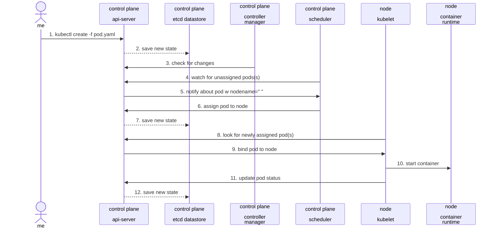

# Scheduled Backups

To do

- [Back to README](../README.md)


## Thoughts on random things I learned during this project


### Overlays

In Kustomize, "Bases" and "Overlays" are concepts used to manage and customize Kubernetes configurations:

Bases: These are the foundational configurations, typically the common, core settings required for a Kubernetes application. Bases include the basic resources like Deployments, Services, and ConfigMaps.

Overlays: Overlays are modifications or environment-specific customizations applied to the base. They allow for variations like development, staging, and production configurations, each potentially having different resource requirements, environment variables, etc.

I plan to implement this functionality in a more complete version of this project where I would use Bases and Overlays for the AWX operator with a dev and production environment, my file/folder structure could look like this:

Base Directory: Contains common configurations for both environments.

```shell
base/
├── kustomization.yaml
├── deployment.yaml
├── service.yaml
```

Dev Overlay: Customizes the base for the development environment.

```shell
overlays/
├── dev/
│   ├── kustomization.yaml
│   ├── dev-specific-config.yaml
```

Production Overlay: Customizes the base for the production environment.

```shell
├── prod/
    ├── kustomization.yaml
    ├── prod-specific-config.yaml
```

In overlays/dev/kustomization.yaml and overlays/prod/kustomization.yaml, you'd reference the base and include environment-specific modifications. This structure allows you to manage common configurations in the base while maintaining environment-specific adjustments in the overlays.


### Flannel

While researching the k3s installation script they provide, I saw a few references and some examples specifying flannel-options as optional command line parameters. It turns out this wasn't anything to do with a flannel shirt like I was picturing in my head.

Flannel is a simple and easy-to-use network fabric for Kubernetes, providing several backend options to fit different network requirements:

- VXLAN: The default backend, it encapsulates network traffic in a virtual network over the existing network infrastructure.
- Host-gw: Creates a simple route-based network, providing efficient traffic routing.
- UDP: An older backend, using UDP to encapsulate traffic, less efficient and generally not recommended.
- AWS VPC: Integrates directly with the AWS VPC network, for AWS-hosted Kubernetes clusters.

Each backend option has its unique characteristics and performance implications, and the choice depends on the specific needs and constraints of your Kubernetes environment.

Glen Kosaka over at SUSE has a great blog worth checking out.
[How Kubernetes Networking Works - Under the Hood](https://www.suse.com/c/advanced-kubernetes-networking/)

### Note taking and diagraming

While working on this I kept trying to visualize how these components are working together. It helped me to note what each component is for to keep them separate in my mind. And draw some diagrams to refer to along the way. This is an example of how I did that.

The setup involving AWX Operator and Minikube with Kustomize, the workflow looked like this:

> - **Minikube or k3s**: Acts as the Kubernetes environment, hosting all other components.
>
> - **kubectl**: is a command-line tool for interacting with a Kubernetes cluster, allowing you to deploy applications, inspect and manage cluster resources, and view logs. It's a direct interface for the Kubernetes API.
>
> - **Kustomize**: Used for customizing Kubernetes configurations, relevant for setting up environments in Minikube.
>
> - **AWX Operator**: A Kubernetes operator for AWX, responsible for deploying and managing AWX instances within the Kubernetes cluster.
{: .prompt-info }

Using mermaid you can create diagrams in markdown easily.



Thats it for now. As I continue to learn new things on this topic, I will update this post with my thoughts.
